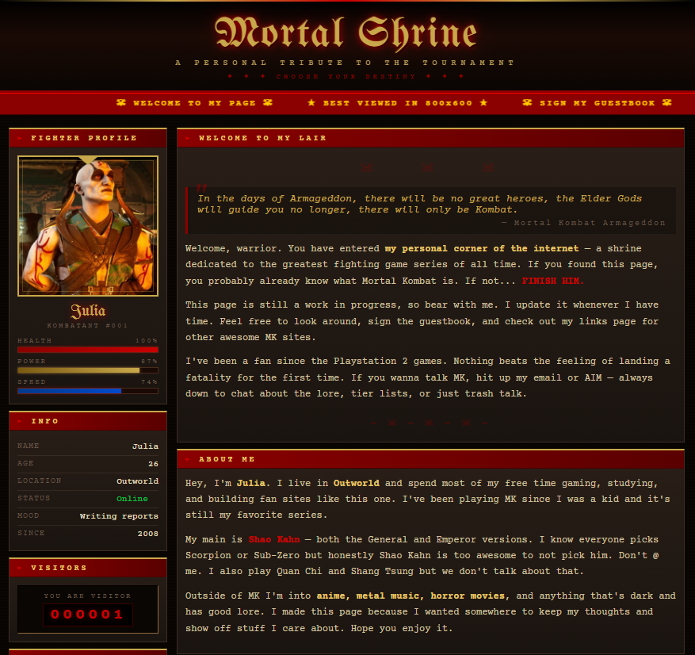

# ☠ Mortal Shrine ☠
### A Web 1.0/2.0 Mortal Kombat Personal Fan Page

> *"There is no knowledge that is not power."* — Shang Tsung

---


## About

**Mortal Shrine** is a personal fan/profile page built in the spirit of early-2000s internet culture — think GeoCities, fan webrings, and sites best viewed at 800×600 in Internet Explorer 6. It's themed around the **Mortal Kombat Armageddon / Deadly Alliance era** and designed to feel like a relic of that golden age of handcrafted web pages.

It's intentionally simple: pure **HTML and CSS**, no JavaScript, no frameworks, no build tools. Just a file you open in a browser.

---

## Features

- Gothic/runic typography via Google Fonts (UnifrakturMaguntia + Courier Prime)
- Dark stone + blood red + gold color palette faithful to the MK4–DA era
- Two-column table layout (classic Web 1.0 structure)
- Sidebar with fighter profile card, stat bars, visitor counter, and interest badges
- About me section and favorites table
- Scrolling marquee bar
- "Under Construction" banner (obviously)
- Pure HTML + CSS — zero dependencies, zero JavaScript

---

## Structure

```
mortal-shrine/
├── index.html       ← the whole site lives here
└── photo.jpg        ← your profile picture (optional, see below)
```

That's it. No package.json. No node_modules. No build step. Beautiful.

---

## How to Use

1. Download or clone this repo
2. Open `index.html` in any browser
3. Edit the placeholder text (`YourName`, `YourCity`, etc.) to make it yours
4. Drop your photo in the same folder as `index.html` and update the avatar block (see below)

### Adding Your Profile Picture

Find this in the HTML:

```html
<div class="avatar-frame">
  <div class="avatar-symbol">☠</div>
  <div class="avatar-label">your photo here</div>
</div>
```

Replace it with:

```html
<div class="avatar-frame">
  
</div>
```

### Things You'll Want to Customize

- Your name, age, location, mood, and "online since" date
- The stat bars (health, power, speed) — pure CSS widths, just change the `%`
- The visitor counter number (it's hardcoded, very authentic, very evil, very nice)
- The favorites table entries
- The marquee text
- Your AIM screen name in the footer (RIP AIM)
- The opening quote if Shang Tsung isn't your guy

---

## AI Assistance

This project was built with help from **[Claude](https://claude.ai)** (claude.ai), an AI assistant made by [Anthropic](https://www.anthropic.com). I described what I wanted — a Web 1.0/2.0 personal page, MK4–Deadly Alliance era, just HTML and CSS — and Claude generated the initial code, which I then tweaked to make it my own.

I think being upfront about AI assistance in creative/coding projects is the right call. Claude handled the scaffolding and a lot of the CSS detail work (color variables, the table layout, the health bars, the gothic styling). The content, the choices, and whatever personality this page has are mine.

If you want to build something similar, [Claude](https://claude.ai) is genuinely good at this kind of specific, vibes-driven frontend work. Describe the aesthetic clearly and it'll get you most of the way there. It may take a bit of "prompt engineering", but, from my attempts, Claude provides a better output.

---

## Compatibility Note

Designed to look good on modern browsers while *feeling* like it was made for old ones. The marquee tag is in there unironically.

---

## License

Do whatever you want with this. It's a fan page. Mortal Kombat belongs to WB Games / NetherRealm Studios. This is just a tribute.
